# 🔐 Keycloak + OpenSearch Integration

A complete Helm chart for deploying **Keycloak** with **OpenSearch** and **OpenSearch Dashboards**, featuring automated OIDC (OpenID Connect) authentication integration.

## 🌟 Features

- 🚀 **One-click deployment** of Keycloak + OpenSearch stack
- 🔐 **Automated OIDC setup** - No manual configuration required
- 📊 **OpenSearch Dashboards** with Keycloak authentication
- 🔧 **Production-ready** configurations with security best practices
- 🎯 **Local development** friendly with Docker Desktop
- 📝 **Automated client creation** using Keycloak REST API
- 🔄 **Configurable** through Helm values

## 🏗️ Architecture

```mermaid
graph TB
    User[👤 User<br/>my-domain.local] --> Ingress[🌐 NGINX Ingress<br/>Controller]
    
    Ingress --> |/keycloak-auth/*| Keycloak[🔐 Keycloak<br/>Identity Provider]
    Ingress --> |/*| Dashboard[📊 OpenSearch<br/>Dashboards]
    
    Keycloak --> PostgreSQL[(🗄️ PostgreSQL<br/>Database)]
    
    Dashboard --> |HTTPS + Basic Auth| OpenSearch[🔍 OpenSearch<br/>Cluster]
    Dashboard --> |OIDC Authentication| Keycloak
    
    OpenSearch --> Master[📋 Master Node]
    OpenSearch --> Data[💾 Data Node]
    OpenSearch --> Coordinating[🔄 Coordinating Node]
    OpenSearch --> Ingest[📥 Ingest Node]
    
    Job[⚙️ Setup Job] --> |REST API| Keycloak
    Job --> |Creates OIDC Client| Config[⚙️ Client Config]
    
    classDef user fill:#e1f5fe
    classDef keycloak fill:#fff3e0
    classDef opensearch fill:#e8f5e8
    classDef infrastructure fill:#f3e5f5
    classDef database fill:#fce4ec
    
    class User user
    class Keycloak,Job,Config keycloak
    class Dashboard,OpenSearch,Master,Data,Coordinating,Ingest opensearch
    class Ingress infrastructure
    class PostgreSQL database
```



### 🔄 Authentication Flow

```mermaid
sequenceDiagram
    participant U as 👤 User
    participant D as 📊 Dashboard
    participant K as 🔐 Keycloak
    participant OS as 🔍 OpenSearch
    
    U->>D: 1. Access Dashboard
    D->>K: 2. Redirect to Keycloak Login
    K->>U: 3. Login Form
    U->>K: 4. Submit Credentials
    K->>K: 5. Validate User
    K->>D: 6. Return OIDC Token
    D->>OS: 7. Query with Token
    OS->>D: 8. Return Data
    D->>U: 9. Display Dashboard
```



## 🚀 Quick Start

### Prerequisites

- Kubernetes cluster (k3d, Docker Desktop, minikube, or any K8s cluster)
- Helm 3.x installed
- kubectl configured

### 1. Setup Helm Dependencies

```bash
# Add Bitnami repository
helm repo add bitnami https://charts.bitnami.com/bitnami
helm repo update

# Download chart dependencies
helm dependency update
```

### 2. Configure Local Domain (For Development)

#### 🍎 **macOS/Linux**
```bash
# Get your local IP
ipconfig getifaddr en0  # macOS
ip addr show           # Linux

# Add to hosts file
echo "YOUR_IP  my-domain.local" | sudo tee -a /etc/hosts
```

#### 🪟 **Windows**
```bash
# Get your local IP
ipconfig

# Edit hosts file as Administrator
# File: C:\Windows\System32\drivers\etc\hosts
# Add: YOUR_IP  my-domain.local
```

#### 🐳 **Docker Desktop**
```bash
# For Docker Desktop, you can use:
echo "kubernetes.docker.internal  my-domain.local" | sudo tee -a /etc/hosts
```

### 3. Deploy the Stack

```bash
# Deploy Keycloak + OpenSearch
helm upgrade --install --create-namespace \
  -n keycloak-openseach \
  keycloak-openseach . \
  -f values.yaml
```

### 4. Wait for Deployment

```bash
# Watch pods starting up
kubectl get pods -n keycloak-openseach -w

# Check when all pods are ready
kubectl get pods -n keycloak-openseach
```

### 5. Access the Applications

Once deployed, you can access:

- 🌐 **OpenSearch Dashboards**: http://my-domain.local
- 🔐 **Keycloak Admin**: http://my-domain.local/keycloak-auth/admin
- 📊 **Keycloak Account**: http://my-domain.local/keycloak-auth/realms/master/account

## 🔧 Configuration

### Default Credentials

| Service | Username | Password |
|---------|----------|----------|
| Keycloak Admin | `admin` | `admin123` |

### Customization

Edit `values.yaml` to customize:

```yaml
extras:
  host: "my-domain.local"                    # Your domain
  hostProtocol: "http"                       # http or https
  keycloakClientSecret: "your-secret-here"   # OIDC client secret

keycloak:
  auth:
    adminPassword: "your-admin-password"     # Keycloak admin password

opensearch:
  security:
    adminPassword: "your-opensearch-password" # OpenSearch admin password
```

## 🛠️ Development & Debugging

### Generate Templates

```bash
# Preview all Kubernetes manifests
helm template keycloak-openseach . -f values.yaml --output-dir ./output
```

## 🔐 Security Features

- ✅ **HTTPS Ready** - Just change `hostProtocol` to `https` and configure TLS
- ✅ **RBAC Enabled** - Role-based access control configured
- ✅ **Network Policies** - Pod-to-pod communication restrictions
- ✅ **Secret Management** - Passwords stored in Kubernetes secrets
- ✅ **Multi-tenancy** - OpenSearch tenants support

## 🏭 Production Considerations

For production deployment:

1. **Use HTTPS**: Configure TLS certificates and ingress
2. **External Database**: Use external PostgreSQL for Keycloak
3. **Persistent Storage**: Enable persistent volumes for data
4. **Resource Limits**: Set appropriate CPU/memory limits
5. **Backup Strategy**: Implement backup for Keycloak and OpenSearch data
6. **Monitoring**: Add Prometheus/Grafana monitoring
7. **High Availability**: Scale components for redundancy

## 📚 Components

This chart includes:

- **[Keycloak](https://www.keycloak.org/)** - Identity and access management
- **[OpenSearch](https://opensearch.org/)** - Search and analytics engine  
- **[OpenSearch Dashboards](https://opensearch.org/docs/latest/dashboards/)** - Data visualization
- **[NGINX Ingress](https://kubernetes.github.io/ingress-nginx/)** - Load balancer and ingress
- **[PostgreSQL](https://www.postgresql.org/)** - Database for Keycloak

## 📄 License

This project is licensed under the MIT License - see the [LICENSE](LICENSE) file for details.

## 🙏 Acknowledgments

- [Bitnami Helm Charts](https://github.com/bitnami/charts) for the excellent base charts
- [OpenSearch Project](https://opensearch.org/) for the search platform
- [Keycloak](https://www.keycloak.org/) for identity management

---

**⭐ If this helped you, please give it a star!**