# 🔐 Keycloak + WebDAV Integration

Secure WebDAV file server with OAuth2/OIDC authentication powered by Keycloak on Kubernetes.

## ✨ Features

- 🔒 **OAuth2/OIDC Authentication** - Keycloak integration
- 📁 **WebDAV Server** - Full protocol support  
- 🔐 **Enterprise Security** - JWT tokens, RBAC, security contexts
- ⚙️ **Production Ready** - Helm charts with best practices
- 🐳 **Cloud Native** - Kubernetes deployment with ingress

## 🏗️ Architecture

```mermaid
graph TB
    subgraph "External"
        User[👤 User] --> Browser[🌐 Browser]
    end
    
    subgraph "Kubernetes"
        Ingress[🔀 NGINX Ingress] 
        WebDAV[📁 WebDAV Server]
        Keycloak[🔐 Keycloak]
        DB[(🗄️ PostgreSQL)]
    end
    
    Browser --> Ingress
    Ingress -->|"/*"| WebDAV
    Ingress -->|"/keycloak-auth/*"| Keycloak
    WebDAV -.-> Keycloak
    Keycloak --> DB
```



## 🚀 Quick Start

### Prerequisites
- Kubernetes cluster + Helm 3.x + kubectl

### 1. Setup Dependencies
```bash
helm repo add bitnami https://charts.bitnami.com/bitnami
helm repo add stakater https://stakater.github.io/stakater-charts
helm dependency update
```

### 2. Configure Local Domain (For Development)

#### 🍎 **macOS/Linux**
```bash
# Get your local IP
ipconfig getifaddr en0  # macOS
ip addr show           # Linux

# Add to hosts file
echo "YOUR_IP  my-domain.local" | sudo tee -a /etc/hosts
```

#### 🪟 **Windows**
```bash
# Get your local IP
ipconfig

# Edit hosts file as Administrator
# File: C:\Windows\System32\drivers\etc\hosts
# Add: YOUR_IP  my-domain.local
```

#### 🐳 **Docker Desktop**
```bash
# For Docker Desktop, you can use:
echo "kubernetes.docker.internal  my-domain.local" | sudo tee -a /etc/hosts
```


### 3. Deploy
```bash
helm upgrade --install --create-namespace \
  -n keycloak-webdav keycloak-webdav . -f values.yaml
```

### 4. Access the Applications

Once deployed and configured:

- 📁 **WebDAV File Server**: http://my-domain.local
- 🔐 **Keycloak Admin Console**: http://my-domain.local/keycloak-auth/admin
- � **Keycloak User Account**: http://my-domain.local/keycloak-auth/realms/master/account

## 🔧 Configuration

### Default Credentials
| Service | Username | Password |
|---------|----------|----------|
| Keycloak Admin | `admin` | `admin123` |


##  Security & Production

### Security Features
- ✅ OAuth2/OIDC Authentication
- ✅ JWT Token Security  
- ✅ HTTPS Ready
- ✅ RBAC & Security Contexts
- ✅ Container Hardening

### Production Checklist
- [ ] Configure HTTPS/TLS
- [ ] Use external database
- [ ] Set resource limits
- [ ] Enable monitoring
- [ ] Scale for HA

### Scaling Guide
| Users | WebDAV Replicas | Resources |
|-------|-----------------|-----------|
| 1-50 | 1 | 500m/512Mi |
| 50-200 | 2 | 1000m/1Gi |
| 200+ | 3+ | Custom |


##  License

MIT License - see [LICENSE](LICENSE) file for details.

## 🙏 Acknowledgments

- [Bitnami Helm Charts](https://github.com/bitnami/charts)
- [Keycloak Community](https://www.keycloak.org/)
- [Kubernetes Community](https://kubernetes.io/)

---

**⭐ If this helped you, please give it a star!**